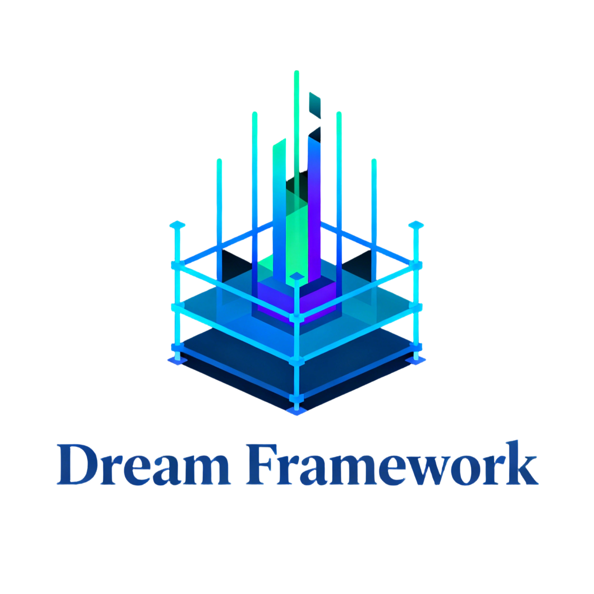

<div align="center">
    
</div>

# Dream Framework

个人用初始脚手架，集成了常见开发组件与功能模块，适用于快速搭建 Java 后端应用，支持代码生成、权限管理、文件处理等基础功能。

## 技术栈

- **核心框架**：Spring Boot 3.2.5
- **ORM框架**：MyBatis-Plus
- **安全框架**：Sa-Token（支持JWT、Redis集成）
- **API文档**：Knife4j (基于OpenAPI 3)
- **数据库**：支持MySQL 8.0+、PostgreSQL 14+（含初始化脚本）
- **构建工具**：Maven
- **其他工具**：
    - 代码简化：Lombok
    - 对象映射：MapStruct
    - 缓存：Redis、Redisson
    - 工具类库：Hutool
    - 树形结构处理：TreeBuilder

## 模块结构

```
dream-framework/
├── dream-app/              # 应用模块
│   └── system-app/         # 系统应用示例（含启动类）
├── dream-module/           # 核心模块
│   ├── module-framework/   # 基础框架（工具类、缓存、通用配置等）
│   └── module-generator/   # 代码生成器（基于MyBatis-Plus Generator）
├── dream-dependencies/     # 依赖管理（统一版本控制）
└── script/                 # 数据库脚本（MySQL/PostgreSQL）
```

### Web 端
- Github：https://github.com/jiangbyte/dream-framework-pc
- Gitee：https://gitee.com/jiangbyte/dream-framework-pc

### 管理后台
- Github：https://github.com/jiangbyte/dream-framework-admin
- Gitee：https://gitee.com/jiangbyte/dream-framework-admin

### 其他版本后端
#### Go 版本（暂停中）
- Github：https://github.com/jiangbyte/galaxy
- Gitee：https://gitee.com/jiangbyte/galaxy

#### Python 版本（构建中）
- Github：-
- Gitee：-

## 功能特点

### 用户认证与授权
- 基于Sa-Token实现登录/注册/权限控制
- 角色菜单权限管理（支持多角色层级，如超级管理员、系统管理员等）
- 集成Redis存储令牌，支持分布式环境

### 代码生成器
- 自动生成分层代码：Entity、DTO、Controller、Service、Mapper
- 支持生成Vue前端页面及API文件（.vue、.ts）
- 可通过`Gen.execute()`方法自定义生成规则，支持多模块配置

### 基础组件
- 树形结构构建工具（TreeBuilder）：通用树形数据组装
- 文件信息处理工具（FileInfo）
- 邮件发送服务（EmailService）
- 统一异常处理与结果封装
- 分页查询与排序工具

### 系统管理功能
- 菜单管理
- 角色权限配置
- 操作日志记录
- 多环境配置支持（dev/prod）

## 快速开始

### 环境要求
- JDK 21+
- Maven 3.6+
- MySQL 8.0+ 或 PostgreSQL 14+

### 启动步骤

1. 克隆仓库
```bash
git clone <仓库地址>
cd dream-framework
```

2. 初始化数据库
- 根据数据库类型执行对应脚本：
    - MySQL: `script/mysql/init.sql`
    - PostgreSQL（暂时未全适配）: `script/pgsql/init.sql`

3. 配置数据库连接
- 修改 `dream-app/system-app/src/main/resources/application-local.yaml` 中的数据库配置

4. 启动应用
```bash
# 方式1：Maven直接启动
mvn spring-boot:run -pl dream-app/system-app

# 方式2：打包后启动
mvn clean package
java -jar dream-app/system-app/target/system-app-1.0.0.jar
```

5. 访问API文档
- 地址：http://localhost:8081/doc.html
- 包含登录、权限管理等接口示例

## 多环境配置

- 开发环境：`dev`（默认）
- 生产环境：`prod`

通过Maven命令指定环境：
```bash
mvn clean package -Pprod
```

## 自定义扩展

### 添加新模块
1. 在`dream-app`下创建新的应用模块
2. 配置`pom.xml`依赖`module-framework`核心模块

### 使用代码生成器
1. 调用`Gen.execute()`方法，指定参数：
    - 数据库连接信息
    - 生成模块与表名
    - 是否生成后端代码（`addBackend`）
    - 是否生成前端代码（`addApiAndView`）
2. 支持自定义Freemarker模板扩展生成规则

## 注意事项

- 本地配置文件`application-template.yaml`为模板
- 敏感信息（如数据库密码、密钥等）建议通过环境变量或配置中心注入
- 默认端口为8081，可在`application.yaml`中修改
